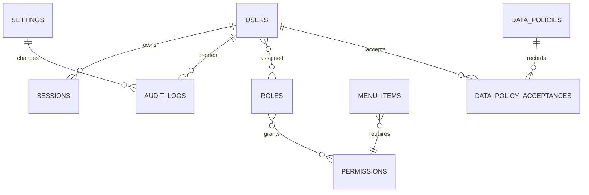

# CRM Administrativo Corporativo

## 1. Resumen funcional
Aplicacion web administrativa, multiusuario y modular para centralizar usuarios, roles, permisos, dashboard, tareas, presupuesto, indicadores, ahorros, aplicativos, contratos, comites, archivos, notificaciones, auditoria, configuracion, perfil y asistente interno con IA.

## 2. Arquitectura
Base MVC con Laravel 13, Blade, Livewire, Alpine, Tailwind, servicios de dominio, Form Requests, Policies, Jobs, Events, Notifications y migraciones como fuente oficial de estructura.

## 3. Diagrama textual
Usuario -> Navegador -> Nginx/Apache -> Laravel -> Controlador/Livewire -> Servicio -> Modelo Eloquent -> MySQL. Procesos asincronos: Laravel -> Redis Queue -> Worker/Supervisor -> Notificacion/Auditoria. Tiempo real: Laravel -> Reverb -> Navegador.

## 4. Stack definitivo
PHP 8.5.4, Laravel 13, MySQL 8.4.x, Redis, Blade, Livewire, Alpine.js, Tailwind CSS, Vite, Sanctum/Fortify, Reverb, Horizon, Pulse, Scout, Laravel Excel y generador PDF compatible.

## 5. Estructura de carpetas
`app/Modules` para agrupacion funcional, `app/Services` para logica de negocio, `app/Actions` para casos de uso puntuales, `app/Policies` para autorizacion, `app/Http/Requests` para validacion, `resources/views` para Blade responsivo y `docs` para decisiones tecnicas.

## 6. Entidades iniciales
Usuarios, roles, permisos, elementos de menu, sesiones, auditoria, configuracion, archivos y politicas legales. Los modulos de negocio agregaran sus entidades en fases posteriores.

## 7. Diagrama entidad-relacion


## 8. Matriz de roles y permisos
Superadministrador: todos los permisos. Administrador: gestion operativa, usuarios limitados, configuracion no sensible. Gestor: modulos de negocio asignados. Auditor: lectura y exportacion de auditoria. Visualizador: lectura autorizada.

Permisos base: `dashboard.view`, `users.*`, `roles.*`, `committees.*`, `tasks.*`, `budgets.*`, `indicators.*`, `savings.*`, `applications.*`, `contracts.*`, `audit.view`, `audit.export`, `settings.view`, `settings.update`, `assistant.use`, `assistant.configure`.

## 9. Modelo de amenazas
Riesgos principales: acceso vertical u horizontal indebido, robo de sesion, XSS en relatos, carga de archivos maliciosos, fuga de secretos, abuso de IA, prompt injection, exportaciones no autorizadas, cambios sin auditoria y fallas de backup.

Mitigaciones iniciales: Policies, middleware, CSRF, cookies seguras, validacion centralizada, almacenamiento privado, auditoria inmutable, permisos granulares, rate limiting, cifrado de secretos y confirmacion para acciones sensibles.

## 10. Plan de Fase 1
Crear base Laravel, configurar entorno, instalar Livewire/Alpine/Tailwind/Vite, crear layout responsivo, menu modular, vistas legales publicas, estructura de carpetas, documentacion y validacion de compatibilidad.

## 11. Comandos de creacion
```bash
composer create-project laravel/laravel . "^13.0"
composer require livewire/livewire
npm install
npm install alpinejs @alpinejs/focus lucide
npm run build
php artisan key:generate
php artisan migrate
```

## 12. Extensiones PHP
Requeridas o recomendadas: bcmath, ctype, curl, dom, fileinfo, gd, intl, mbstring, mysqli, openssl, pdo_mysql, redis, sodium, tokenizer, xml, xmlreader, xmlwriter, zip.

## 13. Validacion de compatibilidad
El proyecto declara `php: ^8.5` y `laravel/framework: ^13.0`. El entorno local actual detectado usa PHP 8.4.23, por lo que debe cambiarse Laragon a PHP 8.5.4 antes de ejecutar nuevas instalaciones o validar plataforma completa.

## 14. Configuracion local con Laragon
Crear host `crm.test`, apuntar a `C:\laragon\www\crm\public`, seleccionar PHP 8.5.4, reiniciar servicios y configurar `.env` con MySQL local, Redis local y correo en modo `log` o SMTP interno.

## 15. Configuracion de MySQL Workbench
Crear conexion a `127.0.0.1:3306`, base `crm_administrativo`, usuario `crm_app` con privilegios minimos sobre esa base, revisar tablas e indices solo como inspeccion. Cambios estructurales oficiales siempre mediante migraciones.

## 16. Configuracion de produccion
Ubuntu Server 26.04 LTS, Nginx, PHP-FPM 8.5, MySQL 8.4.10, Redis, Supervisor, Cron, TLS, usuario de despliegue sin root, `APP_ENV=production`, `APP_DEBUG=false`, cache de configuracion/rutas/vistas/eventos y backups previos a migraciones.

## 17. Riesgos
El mayor riesgo inmediato es ejecutar Composer con PHP inferior a 8.5. Tambien deben controlarse paquetes no compatibles con Laravel 13, configuraciones `.env` copiadas a Git, permisos excesivos en MySQL y pantallas hechas solo para escritorio.

## 18. Criterios responsive
Mobile first, menu off-canvas en celular, sidebar en escritorio, tablas con scroll controlado o tarjetas, formularios a una columna en celular, modales accesibles, botones tactiles, texto sin superposicion y sin scroll horizontal global.
